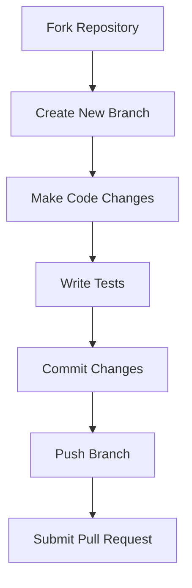

# Contributing to GitKraken-Compendium

Thank you for considering contributing to GitKraken-Compendium! 🎉

We welcome contributions in the form of bug reports, feature requests, documentation improvements, and code contributions. By contributing, you help make GitKraken-Compendium better for everyone.

## Bug Reports and Feature Requests

If you encounter a bug or have a feature request, please open an issue on the [Issue Tracker](https://github.com/AnthonyByansi/GitKraken-Compendium/issues) and provide as much detail as possible. This will help us understand and address the issue efficiently.

## Documentation Improvements

The GitKraken-Compendium documentation can always benefit from improvements. If you find any errors, unclear explanations, or missing information, feel free to submit a pull request. We appreciate your attention to detail and efforts to make the documentation more comprehensive and accurate.

## Code Contributions

If you are interested in making code contributions to GitKraken-Compendium, please follow these steps:

1. Fork the repository and create a new branch from `main`.
2. Make your code changes, ensuring adherence to the coding conventions and best practices.
3. Write tests to cover your changes and ensure existing tests pass.
4. Commit your changes and write clear, concise commit messages.
5. Push your branch to your forked repository.
6. Submit a pull request to the `main` branch of the main repository.

We will review your pull request and provide feedback as soon as possible. Your contributions will be thoroughly appreciated!

---

## Code Style and Conventions

Please adhere to the following code style and conventions when making code contributions:

- Use consistent indentation (e.g., 2 spaces) and meaningful variable names.
- Follow the existing naming conventions for functions, variables, and classes.
- Write clear and concise comments to improve code readability.
- Ensure your code follows best practices and is optimized for performance.
- Document any public-facing functions or methods with JSDoc-style comments.

  ---

## License

By contributing to GitKraken-Compendium, you agree that your contributions will be licensed under the [MIT License](LICENSE).

---

> Below is a Mermaid diagram showing the Git workflow for making contributions:

---
