# Core Features of GitKraken 🚀

GitKraken offers a wide range of powerful features that enhance your Git workflow and simplify version control. In this guide, we will explore the core features of GitKraken and how to effectively use them. 📚

## Table of Contents 📑

- [Visual Git Graph](#visual-git-graph) 🌳
- [Effortless Branching and Merging](#effortless-branching-and-merging) 🌿
- [Code Reviews and Collaboration](#code-reviews-and-collaboration) 👥
- [Advanced Search and Filtering](#advanced-search-and-filtering) 🔍
- [Interactive Rebase](#interactive-rebase) 🔄
- [Issue Tracking Integration](#issue-tracking-integration) 📎

## Visual Git Graph 🌳

The visual Git graph in GitKraken provides an intuitive and interactive representation of your Git repository. Key features include:

- **Commit History**: View all commits in your repository, their messages, and their relationships in an easy-to-understand graph. 📜📊

- **Branches and Tags**: Visualize branches and tags, switch between branches, create new branches, and perform branch-related operations. 🌿🏷️

- **Merge and Rebase**: Easily merge branches or rebase commits using drag-and-drop functionality within the commit-graph. 🔄🔀

## Effortless Branching and Merging 🌿

GitKraken simplifies the process of creating and managing branches, as well as merging changes. Key features include:

- **Branch Management**: Create, rename, and delete branches with ease. Switch between branches effortlessly for seamless context switching. 🌿🔀

- **Conflict Resolution**: Resolve merge conflicts directly within the GitKraken interface using the built-in merge tool or an external merge tool of your choice. ⚖️✅

- **Pull Requests**: Create pull requests from within GitKraken, review and comment on changes, and facilitate effective collaboration with your team. 📥💬👥

## Code Reviews and Collaboration 👥

GitKraken streamlines code reviews and enable seamless collaboration. Key features include:

- **Inline Comments**: Provide feedback on specific lines of code by adding inline comments directly within the GitKraken interface. 💬📝

- **Reviewer Workflow**: Easily review and approve changes made by others. View the status of pull requests and participate in meaningful discussions. 👀✅💬

- **Notifications**: Stay updated with notifications for pull request updates, comments, and mentions to ensure efficient collaboration. 📩🔔📢

## Advanced Search and Filtering 🔍

GitKraken offers powerful search and filtering capabilities to help you navigate through your repository effectively. Key features include:

- **Quick Search**: Find specific commits, branches, tags, and files by using the search bar at the top of the GitKraken interface. 🔎🔍

- **Filtering**: Refine your view by applying filters based on author, time range, commit message, file status, and more. 📋🔖

## Interactive Rebase 🔄

GitKraken provides an interactive rebase feature, allowing you to modify the commit history of your branch. Key features include:

- **Squashing Commits**: Combine multiple commits into a single commit to keep your commit history clean and concise. 🔀✨

- **Rearranging Commits**: Reorder commits to organize your commit history logically. ↕️🔀

- **Editing Commit Messages**: Edit commit messages to provide clearer and more descriptive information. 📝✏️

## Issue Tracking Integration 📎

GitKraken seamlessly integrates with popular issue-tracking platforms like Jira and Trello. Key features include:

- **Linking Commits and Branches**: Connect Git commits and branches to specific issues or tasks in your issue tracking system. 🔗🔀📎

- **Tracking Issue Status**: Stay informed about the status of issues within GitKraken, making it easier to track progress and relate code changes to specific tasks. 📊📎

```mermaid
graph TD

A[Core Features of GitKraken] --> B[Visual Git Graph]
A --> C[Effortless Branching and Merging]
A --> D[Code Reviews and Collaboration]
A --> E[Advanced Search and Filtering]
A --> F[Interactive Rebase]
A --> G[Issue Tracking Integration]

B --> B1[Commit History]
B --> B2[Branches and Tags]
B --> B3[Merge and Rebase]

C --> C1[Branch Management]
C --> C2[Conflict Resolution]
C --> C3[Pull Requests]

D --> D1[Inline Comments]
D --> D2[Reviewer Workflow]
D --> D3[Notifications]

E --> E1[Quick Search]
E --> E2[Filtering]

F --> F1[Squashing Commits]
F --> F2[Rearranging Commits]
F --> F3[Editing Commit Messages]

G --> G1[Linking Commits and Branches]
G --> G2[Tracking Issue Status]

style A fill:#FFC700, stroke:#000000, stroke-width:2px;
style B fill:#D2E5FF, stroke:#000000, stroke-width:2px;
style C fill:#FFD7D7, stroke:#000000, stroke-width:2px;
style D fill:#B6FFB6, stroke:#000000, stroke-width:2px;
style E fill:#FFE8B6, stroke:#000000, stroke-width:2px;
style F fill:#FFC7FF, stroke:#000000, stroke-width:2px;
style G fill:#D7D7D7, stroke:#000000, stroke-width:2px;
style B1,B2,B3,C1,C2,C3,D1,D2,D3,E1,E2,F1,F2,F3,G1,G2 fill:#FFFFFF, stroke:#000000, stroke-width:2px;

```

--- 

By leveraging these core features of GitKraken, you can enhance your version control workflow, streamline collaboration, and optimize your Git experience. 🚀🔗💻
