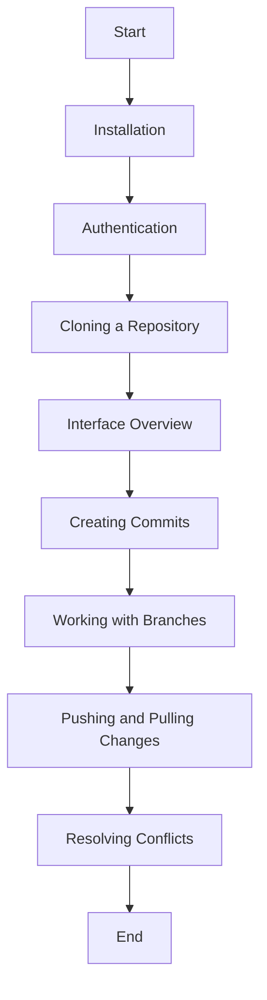

# Getting Started with GitKraken 🐙

This guide will walk you through the initial setup and basic usage of GitKraken, helping you get started with version control and collaboration. 👣

## Table of Contents 📑

- [Installation](#installation-) 📥
- [Authentication](#authentication-) 🔐
- [Cloning a Repository](#cloning-a-repository-) 📂
- [Interface Overview](#interface-overview-) 🖥️
- [Creating Commits](#creating-commits-) ✍️
- [Working with Branches](#working-with-branches-) 🌿
- [Pushing and Pulling Changes](#pushing-and-pulling-changes-) 🔄
- [Resolving Conflicts](#resolving-conflicts-) ⚖️

## Installation 💻

Ensure that GitKraken is successfully installed on your system by following the installation guide provided in [user-guide/installation.md](installation.md).

## Authentication 🔐

1. Launch GitKraken and sign in with your Git hosting provider credentials (e.g., GitHub, Bitbucket, GitLab) to connect your account. 👥

2. Authenticate GitKraken to access your repositories and enable seamless integration with your Git hosting platform. 🔑

## Cloning a Repository 📂

1. Click on the "Clone" button in the GitKraken toolbar. 📥

2. Provide the URL of the repository you want to clone and select a local directory to store the repository. 🌐📁

3. Click "Clone the repo!" to initiate the cloning process. 🚀

## Interface Overview 🖥️

1. Familiarize yourself with the main components of the GitKraken interface, including the commit-graph, file tree, and panels for branches, commit details, and file changes. 📊🌳📝

2. Explore the various visual indicators and icons used in the interface to represent different states and actions. 🌈🔍

## Creating Commits ✍️

1. Make changes to your files within your local repository. ✏️📂

2. Open the GitKraken interface and review the file changes in the "Unstaged Files" section. 📝🔄

3. Stage the desired files for the next commit by clicking on the "+" icon next to each file or using the "Stage All" button. ➕📎

4. Provide a commit message that clearly describes the changes made in the commit. 📝💬

5. Click the "Commit" button to create the commit. ☑️🚀

## Working with Branches 🌿

1. Create a new branch by clicking on the branch dropdown in the toolbar and selecting "New Branch" or by right-clicking on a commit in the graph and choosing "New Branch Here". 🌱➕

2. Switch between branches by selecting the desired branch from the branch dropdown. 🔀

3. Merge branches by dragging one branch onto another in the commit-graph or by right-clicking on a branch and selecting "Merge branch into current". 🔄🔗

## Pushing and Pulling Changes 🔄

1. Push your local commits to the remote repository by clicking on the "Push" button in the toolbar. 🔃🚀

2. Pull the latest changes from the remote repository to your local repository by clicking on the "Pull" button in the toolbar. 🔃📥

## Resolving Conflicts ⚖️

1. In case of conflicts during a merge or pull operation, GitKraken will display the conflicted files with options to resolve them. ⚠️🔀🔒

2. Use the built-in merge tool or an external merge tool of your choice to resolve conflicts. 🛠️🔧

3. After resolving conflicts, stage the modified files and create a new commit. ➕✍️

--- 

Congratulations! You are now familiar with the basic usage of GitKraken. Continue exploring the advanced features and capabilities of GitKraken in the user guide to enhance your version control workflow. 👏🎉

