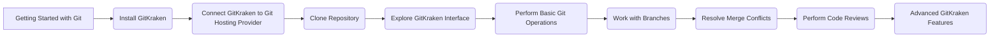

# GitKraken-Compendium 🐙

The GitKraken-Compendium repository serves as a comprehensive guide and resource for exploring the features, functionalities, and best practices associated with GitKraken, a popular Git client.

## Table of Contents 📚

- [Introduction](#introduction-)
- [Documentation](#documentation-)
- [Source Code](#source-code-)
- [Testing](#testing)
- [Contributing](#contributing-)
- [License](#license-)

## Introduction 🌟

GitKraken-Compendium provides in-depth documentation on how to effectively use GitKraken for efficient and streamlined version control. Whether you are a beginner or an experienced user, this repository will help you unlock the full potential of GitKraken.

## Documentation 📖

The `docs/` directory contains detailed user guides, API references, tutorials, and additional resources to help you understand and master GitKraken. It covers various topics such as installation, getting started, core features, advanced features, troubleshooting, and more.

## Source Code 🏗️ 

The `src/` directory holds the source code for different components of GitKraken. It includes the core functionality, extensions (Glo Boards, Timelines, CLI), and utility functions. Feel free to explore the source code to gain insights into how GitKraken works under the hood.

## Testing 🧪

The `tests/` directory contains test suites that correspond to the different sections of the documentation. These tests ensure the reliability and correctness of the GitKraken-Compendium repository. Contributions to the test suite are welcome to enhance the overall quality of the documentation.

## Contributing 🤝

Contributions to GitKraken-Compendium are highly appreciated! If you would like to contribute, please follow the guidelines outlined in the [CONTRIBUTING.md](CONTRIBUTING.md) file. By contributing, you agree to release your contributions under the [MIT License](LICENSE).

## GitKraken Learning Roadmap

The following Mermaid architecture diagram illustrates a suggested learning roadmap for GitKraken:

---

## License 📃

This repository is licensed under the [MIT License](LICENSE). By using or contributing to GitKraken-Compendium, you agree to the terms and conditions of this license.

> "In the world of version control, GitKraken is your trusty ship that helps you sail smoothly through the seas of collaboration." - [Byansi Anthony](https://github.com/AnthonyByansi)
